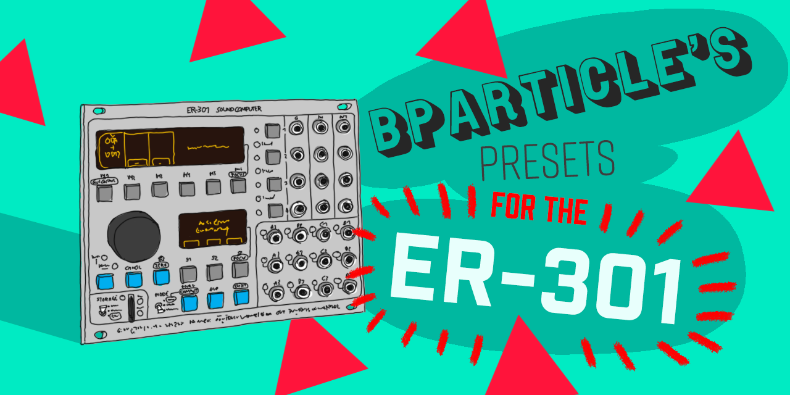

# Bparticle's presets for the ER-301 sound computer

## Binaural Beats
A tuned binaural beats machine.

**Forum discussion**: https://forum.orthogonaldevices.com/t/binaural-beats-unit

**type**: oscillator/voice

**file**: <a href="https://github.com/bparticle/bparticle/raw/master/binaural-beats.unit">binaural-beats.unit</a>

## Itchy
Sample scratching and mixing with external audio or internal sounds.

**Forum discussion**: https://forum.orthogonaldevices.com/t/itchy-sample-scratching-preset

**type**: utility, effect, stereo

**file**: <a href="https://github.com/bparticle/bparticle/raw/master/Itchy.unit">Itchy.unit</a>

## Punchcard 8
This is an 8 step trigger sequencer.

**Forum discussion**: https://forum.orthogonaldevices.com/t/8-step-trig-sequencer-unit

**type**: utility

**file**: <a href="https://github.com/bparticle/bparticle/raw/master/punchcard-8.unit">punchcard-8.unit</a>

## Straight Shooter
A very simple synth voice based on two oscillators.

**Forum discussion**: https://forum.orthogonaldevices.com/t/discussion-about-a-synth-voices-discussion/2860/13

**type**: oscillator/voice

**file**: <a href="https://github.com/bparticle/bparticle/raw/master/straight_shooter.unit">straight_shooter.unit</a>

## Tilt Cove
A stereo delay effect preset.

**Forum discussion**: https://forum.orthogonaldevices.com/t/tilt-cove-stereo-delay-preset

**type**: effect, stereo

**file**: <a href="https://github.com/bparticle/bparticle/raw/master/Tilt-Cove.unit">Tilt-Cove.unit</a>

## Wave Fader Suite

Mixing presets for wavetable synthesis and other experiments
**Forum discussion**: https://forum.orthogonaldevices.com/t/wave-fader-suite-wavetable-mixing-presets

**type**: utility/mixing

**files**:
* <a href="https://github.com/bparticle/bparticle/raw/master/WaveFader.unit">WaveFader.unit</a>
* <a href="https://github.com/bparticle/bparticle/raw/master/WaveFader-3.unit">WaveFader-3.unit</a>
* <a href="https://github.com/bparticle/bparticle/raw/master/WaveFader-4.unit">WaveFader-4.unit</a>
* <a href="https://github.com/bparticle/bparticle/raw/master/WaveFader-5.unit">WaveFader-5.unit</a>
